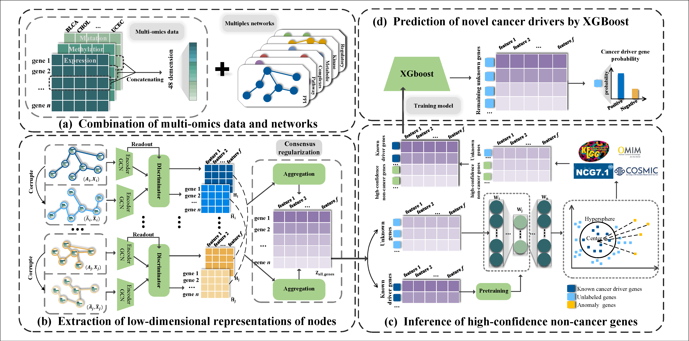

# MMGN

## **Multiplex networks and pan-cancer multiomics-based driver gene identi-fication using graph neural networks**

## Description

Identifying cancer driver genes has paramount significance in elucidating the intricate mechanisms underlying cancer development, progression, and therapeutic interventions. Abundant omics data and interactome networks provided by numerous extensive databases enable the application of graph deep learning techniques that incorporate network structures into the deep learning framework. However, most existing models primarily focus on individual network, inevitably neglecting the in-completeness and noise of interactions. Moreover, samples with imbalanced classes in driver gene identification hamper the performance of models. To address this, we propose a novel deep learning framework MMGN which integrates multiplex networks and pan-cancer multiomics data using graph neural networks combined with negative sample inference to discover cancer driver genes, which not only enhances gene feature learning based on the mutual information and the consensus regularizer, but also achieves balanced class of positive and negative samples for model training. The reliability of MMGN has been verified by the area under the Receiver Operating Characteristic (AUROC) curves and the area under the precision-recall curves (AUPRC). We believe MMGN has the potential to provide new prospects in precision oncology and may find broader applications in predicting bi-omarkers for other intricate diseases.&#x20;

## Getting Started

### Special dependencies
*   python 3.8.3
*   Pytorch 1.10.1
*   Pytorch geometric 2.0.1
*   Sklearn 1.3.2
*   Deepod 0.4.1

### Overview

The codes are organized as follows:&#x20;

*   `main.py`: the main script of MMGN.
*   `embedding.py`: train the model to obtain embedding vectors.
*   `indentify_cancer_gene.py`: identify predicted cancer genes(PCGs).
*   `utils/dmgimodel.py`: the implementation of DMGI.&#x20;
*   `utils/datahandle.py`: the script of data input and output.
*   `utils/CrossValidation.py`: the script of cross validation.

### Input file

*   The input files are located in the `processed_dataset/six_net` directory.
*   To fit the input format of Pytorch geometric, the nodes in the network are represented as indices. The `mapping_dict_EIDtoIndex.pickle` can be used to convert between indices and Entrez IDs.
*   &#x20;`Feature_for_pyG.csv` contains the features of genes (nodes), including 16 types of cancer and multi-omics data such as expression, methylation, and mutation.
*   &#x20;`kcg_intersec.csv` contains the known cancer genes (positive examples).
*   &#x20;`Merge_maybe_cancergene.txt` contains the gene set used for filtering negative samples.

### Output file

*   The generated vectors of genes are saved in the directory  `saved_embedding`.
*   The AUC and AUPRC plots are located in the `images` directory.
*   The `evaluations` directory contains the evaluation results of the model's  cross-validation.

### How to run

`python main.py`

## Version History

*   0.1
    *   Initial Release

## Acknowledgments

We referred to the code repository of the following repository:&#x20;

*   [pyg-team/pytorch\_geometric](https://github.com/pyg-team/pytorch_geometric)
*   [xuhongzuo/DeepOD](https://github.com/xuhongzuo/DeepOD)
